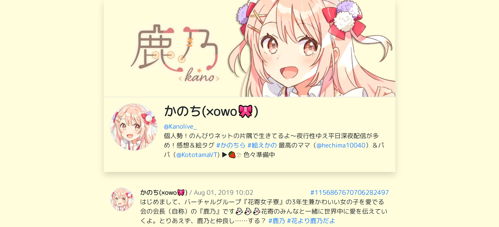

# Kano Hanayori - Twitter Archive

Language: [English](README.md), [简体中文](README.zh-cn.md)

## Introduction

- The Twitter account of Kano Hanayori ([Kanolive_](https://twitter.com/Kanolive_)) has gone private since May 28, 2021.
- This archive contains:
  - 2178 tweets posted from Aug 01, 2019 to May 28, 2021 and
  - 974 corresponding images/thumbnails with each links to a local file or its original URL.
- Open `kano_hanayori_twitter.html` to view the archive.
  - Please download `data/media` and `src/style` as well unless you want to read this archive with text only.
  - Reading with a laptop/desktop is recommended.
  - Unlike Twitter, this archive orders statuses chronologically (oldest &rightarrow; newest).
- The workspace locates separately at [kano_hanayori_twitter_workspace](https://github.com/Nick-Lrc/kano_hanayori_twitter_workspace).
  - Jun.19, 2021: Undergoing the 2nd round of refactoring.
- Please [contact me](mailto:itrust19@yahoo.com) if you notice bugs or have suggestions.

